# Technical Architecture

## Stack

- Unity 6.5.5f1 and Universal Render Pipeline
- C# client with Unity Input System, Addressables, and Unity Test Framework
- Node-based game-brain service
- Versioned JSON contracts shared by client and service
- Local JSON save during the slice; encrypted/authenticated cloud saves considered later

Unity 6.5.5f1 is the installed prototype baseline. Unity recommends Update releases for new and mid-cycle productions; the project can freeze on a supported LTS patch before content lock. Unity supports Android microphone permission flow. Steam requires disclosure of live-generated AI and a description of runtime guardrails.

Primary references:

- https://unity.com/releases/unity-6/support
- https://docs.unity3d.com/6000.0/Documentation/Manual/android-RequestingPermissions.html
- https://partner.steamgames.com/doc/gettingstarted/contentsurvey

## Authority boundaries

### Unity client owns

- input and UI;
- physics and collision;
- resident needs and health;
- authoritative entity IDs and inventory;
- action availability and execution;
- animation, audio playback, and camera;
- local saves and offline behavior;
- final validation of every service response.

### Game-brain service owns

- normalization of free-text item prompts;
- unknown-item semantic specification;
- content classification and moderation decisions;
- conversational response generation;
- selection of a high-level intent from client-provided legal options;
- memory compression and long-term conversation summaries;
- usage controls, provider credentials, observability, and caching.

### The LLM never owns

- frame-by-frame movement;
- raw physics values;
- arbitrary method or script execution;
- direct save mutation;
- spawning unvalidated prefabs;
- spending, account, or store operations;
- microphone activation;
- the list of executable actions.

## Runtime flow

```mermaid
flowchart LR
    A["Mouse or touch drag"] --> B["Lid/search UI"]
    B --> C["Item prompt"]
    C --> D["Local catalog and cache"]
    D -->|known| E["Validated ItemSpec"]
    D -->|unknown| F["Game-brain resolver"]
    F --> G["Moderation and schema validation"]
    G --> E
    E --> H["Visual archetype and physics spawn"]
    H --> I["Affordance graph"]
    I --> J["Resident utility planner"]
    J --> K["Validated action"]
    K --> L["Animation and simulation"]
    L --> M["Event and memory log"]
    M --> N["Dialogue context"]
    N --> O["Structured dialogue service"]
    O --> P["Validate intent and targets"]
    P --> Q["Voice/text output"]
```

## Item model

An `ItemSpec` contains:

- stable canonical ID and display name;
- source prompt and resolver version;
- visual archetype, material hints, color, and scale;
- mass, size, softness, bounciness, fragility, temperature;
- tags and capabilities;
- consumable effects and status risks;
- content classification;
- optional authored asset address.

Prompt text never directly selects a prefab path. The resolver returns a schema-conforming spec, the client clamps numeric values, and the visual factory maps only approved archetypes and addresses.

The current authored catalog is rendered by explicit low-poly composite builders under `Assets/_Project/Gameplay`. Each item keeps one authoritative Rigidbody and a simple sphere, capsule, box, or compound collider; decorative child meshes do not add physics colliders. This makes the item readable without changing its capability contract or multiplying collision cost.

Opaque and transparent runtime colors clone two material templates stored under Gameplay `Resources`. Those assets directly reference URP Lit and its two required surface variants, so player builds retain the shader variants without runtime `Shader.Find` and without adding the full URP Lit shader to Graphics Settings' always-included list. Runtime clones are cached by packed color to bound material count. A focused test verifies the templates, shader reference, transparent keyword, and render queue.

Gameplay maps item outcomes to the Character presentation assembly's public `ResidentPresentationController.SetReaction` API. Presentation owns the pose; Gameplay owns the item appraisal cue and badge. If the presentation controller is unavailable, Gameplay applies a short root motion/color fallback without taking ownership of Character state.

## Interaction model

The client constructs an affordance graph from resident abilities, item capabilities, environment capabilities, and current state.

Examples:

- `SwingTool + ThrowableTarget + CanGrip` → `Strike`
- `SharpEdge + FlexibleLine + CanGrip` → `Cut`
- `Absorbent + Liquid(Water)` → `Wet/Clean`
- `Lever + LidSeam + Resourceful` → `Pry`
- `Edible + SafeToEat + Hungry` → `Eat`

Each candidate action receives utility from:

`need pressure + personality bias + preference + relationship strategy + plan progress - risk - effort - memory aversion`

Special pair rules can add flavor but should not replace capability rules.

## Character cognition

The resident runs three layers:

1. **Reflex layer** — immediate recoil, pain, catch, brace, and collision reactions.
2. **Utility layer** — local deterministic action selection for needs and item use.
3. **Narrative layer** — infrequent service calls for speech, social strategy, memory compression, and plan suggestions.

The client sends the narrative layer a short state digest plus the currently valid high-level intents. The service chooses from those intents and may return `observe` if none fit. This preserves agency without granting executable control.

## Memory

- Episodic ring buffer stores important structured events.
- Relationship state stores trust, affection, fear, resentment, dependency, and perceived reliability.
- Semantic memory stores summarized facts and promises.
- LLM summaries are advisory text; numeric relationship state changes only through local rules.
- Save migrations are versioned from the first playable build.

## Voice

Voice is a pipeline, not a permanently open microphone:

1. player presses and holds a visible control;
2. client requests permission only in context;
3. local capture produces a bounded audio clip;
4. service performs transcription;
5. transcript is shown and may be canceled;
6. structured dialogue is generated;
7. speech is synthesized and played with lip-sync markers when available.

The client must support text-only play, permission denial, network loss, timeouts, and rate limits.

The implemented slice follows that boundary under `Assets/_Project/Voice`. A runtime installer detects `JarLoop` after scene load and adds one idempotent, lower-left conversation panel without editing Gameplay source. It uses push-to-talk or typed input, a bounded session memory/personality context, exact validation of the one client-offered `speak_reply` action, and service-generated WAV playback. A standalone `VoiceConversationDemo` scene exercises the same controller.

The local Node service defaults to deterministic no-key mock transcription, dialogue, and an honest non-speech WAV cue. Optional OpenAI adapters keep all authentication server-side and use multipart transcription, strict structured dialogue output, and server-configured speech synthesis. Invalid JSON, unsafe text, illegal action/target choices, timeouts, and malformed audio all fail closed to usable text/offline behavior. See `docs/AI_VOICE_MILESTONE.md` for setup and current gaps.

## Unknown-item visuals

The slice uses three tiers:

1. authored addressable prefab;
2. approved parametric archetype assembled from primitive meshes and materials;
3. a deliberately stylized “idea object” with icon, silhouette, label, and correct behavior.

Runtime 3D generation is a later research track because latency, platform cost, topology, collision quality, intellectual-property filtering, and Steam disclosure all need proof.

The implemented idea-object fallback currently uses a parcel/ribbon/question-mark composite. It communicates uncertainty but does not yet render a generated label or icon, and it is not a substitute for the schema-validated unknown-item resolver.

## Service and cost controls

- Never embed provider API keys in Unity or Android builds.
- Authenticate game clients through the project backend.
- Rate-limit by account/device and cap audio duration.
- Cache normalized item specs by resolver version.
- Make dialogue event-driven rather than frame-driven.
- Summarize old conversation and send compact state.
- Moderate both prompt input and generated output.
- Log schema failures and rejected action attempts without retaining raw voice longer than necessary.
- Provide a local/offline bark and behavior path.

## Repository ownership

- `Assets/_Project/Core` — shared Unity primitives and contracts
- `Assets/_Project/Gameplay` — jar, items, interactions, input
- `Assets/_Project/Character` — resident state, planning, animation adapters
- `Assets/_Project/UI` — lid search, captions, settings, accessibility
- `Assets/_Project/Tests` — edit-mode and play-mode tests
- `Assets/_Project/Voice` — microphone capture, conversation client, playback, runtime overlay, and standalone demo
- `contracts` — versioned JSON schemas and examples
- `services/game-brain` — resolver, dialogue, memory, moderation, voice adapters
- `docs` — approved product and engineering direction
